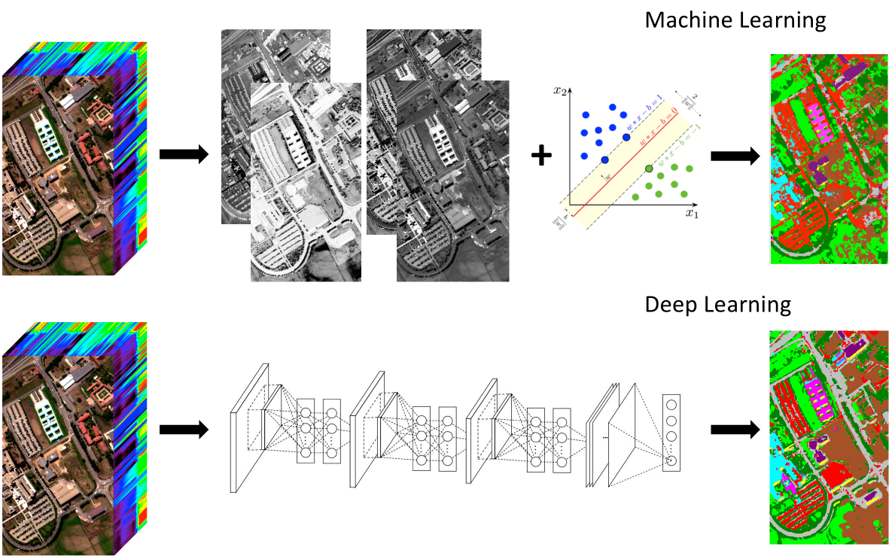

# Feature Extraction for Hyperspectral Imagery: The Evolution from Shallow to Deep (Overview and Toolbox)

Behnood Rasti, Danfeng Hong, Renlong Hang, Pedram Ghamisi, Xudong Kang, Jocelyn Chanussot, Jon Atli Benediktsson
---------------------

The code in this toolbox implements the ["Feature Extraction for Hyperspectral Imagery: The Evolution from Shallow to Deep (Overview and Toolbox)"](https://ieeexplore.ieee.org/document/9082155).
More specifically, it is detailed as follow.

Citation
---------------------

**Please kindly cite the papers if this code is useful and helpful for your research.**

Behnood Rasti, Danfeng Hong, Renlong Hang, Pedram Ghamisi, Xudong Kang, Jocelyn Chanussot, Jon Atli Benediktsson. Feature Extraction for Hyperspectral Imagery: The Evolution from Shallow to Deep (Overview and Toolbox), IEEE Geoscience and Remote Sensing Magazine, 2020, DOI: 10.1109/MGRS.2020.2979764.

     @article{rasti2020feature,
      title     = {Feature Extraction for Hyperspectral Imagery: The Evolution from Shallow to Deep (Overview and Toolbox)},
      author    = {B. Rasti and D. Hong and R. Hang and P. Ghamisi and X. Kang and J. Chanussot and J. Benediktsson},
      journal   = {IEEE Geosci. Remote Sens. Mag.},
      note      = {DOI: 10.1109/MGRS.2020.2979764},
      year      = {2020},
      publisher = {IEEE}
     }
       

The paper provides a detailed and organized overview of hyperspectral feature extraction techniques, categorized into two general sections: shallow feature extraction techniques (further categorized into supervised and unsupervised) and deep feature extraction techniques. Each section provides a critical overview of the state-of-the-art that is mainly rooted in the signal and image processing, statistical inference, and machine (deep) learning fields. The toolbox also includes the Random Forest classifier plus training and test samples used for the Houston 2012 hyperspectral Dataset. The hyperspectral data can be downloaded here (http://hyperspectral.ee.uh.edu/?page_id=459). The shallow and deep feature extraction techniques given in HyFTech is listed below:

Shallow Unsupervised Feature Extraction:

1- PCA: Principal Component Analysis

2- MSTV: Multi-scale Structural Total Variation

3- OTVCA: Orthogonal Total Variation Component Analysis

4- LPP: Locality Preserving Projection

Shallow Supervised Feature Extraction:

5- LDA: Linear Discriminant Analysis

6- CGDA: Collaborative Graph-based Discriminant Analysis

7- LSDR: Least-Squares Dimension Reduction

8- JPlay: Joint & Progressive Learning Strategy

Deep Feature Extraction:

9- SAE: Stacked Autoencoder 

10- RNN: Recurrent Neural Network

11- CNN: Convolutional Neural Network

12- CAE: Convolutional Autoencoder

13- CRNN: Convolutional RNN

14- PCNN: PCA is applied prior to CNN  

Contact Information:
--------------------

Danfeng Hong: hongdanfeng1989@gmail.com 
Danfeng Hong is with the Univ. Grenoble Alpes, CNRS, Grenoble INP, GIPSA-lab, 38000 Grenoble, France.
